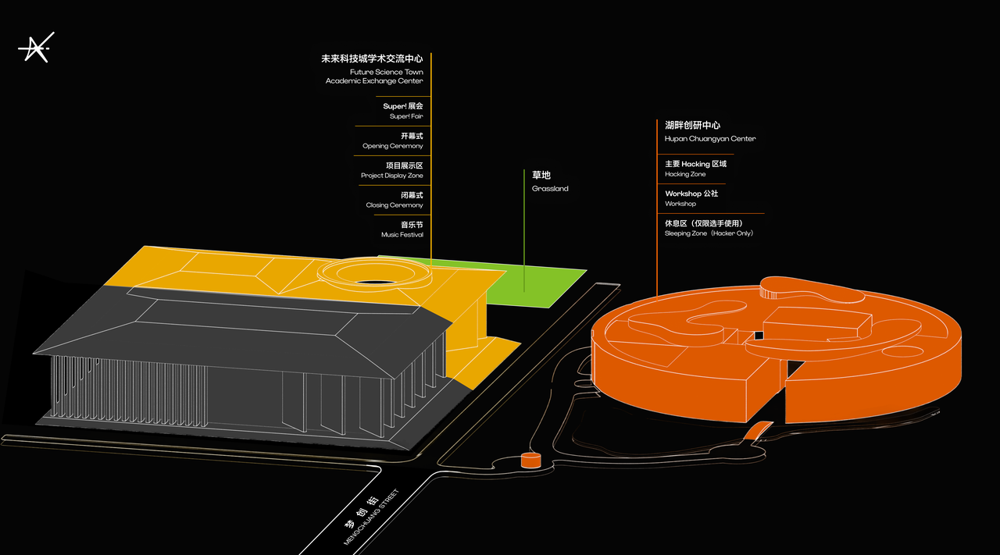

import Aside from '../../../components/ui/Aside.astro';

## 场地即叙事：设计几百个灵魂的动线

一个优秀的黑客松场地，绝不仅仅是提供几排桌子、充足的电源和够快的 Wi-Fi。在 AdventureX，我们始终认为场地是一个有生命的机体，它本身就在讲述一个关于创造、平等与自由的故事。当你摊开一张场地的平面图，你不是在标注功能区，你是在设计这五天里几百个灵魂的动线。你需要像一个建筑师，更要像一个导演，去预演每一个创造者在这里的每一个瞬间。

我们需要思考的是，当一个选手在凌晨三点因为 Bug 而焦头烂额、感到极度疲惫时，他需要走多远才能拿到一罐冰镇的可乐？当两个互不相识的、分别研究大语言模型和机械臂的开发者在走廊相遇时，是否有足够的物理空间让他们停下来，进行一场足以改变项目走向的对话？在 AdventureX 的布局逻辑中，我们刻意消解了“主席台”或“贵宾区”的概念，我们要建立的是一个去中心化的、流动的协作网络。

## 签到区：理想国的第一道大门

签到区是现实世界与逃逸计划的交界点。这不仅是一个效率的问题，更是一个仪式感的问题。在 AdventureX，我们要求签到处必须在活动开始前一小时就处于完美状态。当选手提着厚重的行李，跨越数千公里来到现场，他们拿到的那份物资包和特制的挂牌，就是他们进入这个理想国的登机牌。

我们建议在签到处设置一面巨大的破冰墙。不要让大家只是签个名，要让他们写下自己的技术标签，或者是那些极其私人的、能代表灵魂的爱好。当几百张写着 #Rust, #AnalogSynth, #CatLover 的卡片堆叠在一起时，参与者会瞬间意识到，自己正身处一个由同类组成的社区。这种视觉上的震撼，能瞬间消融选手初来乍到时的怯意，为接下来的组队和协作建立最底层的信任。

## 社交的心脏：游戏场与跃迁空间

黑客松不仅是极限的代码编写，更是高频的灵感交换。我们需要一些能让人“松弛”下来的空间，我们称之为社交的心脏。比如充满懒人沙发的游乐场，在这里，你可以躺着思考，可以和刚认识的朋友打一局复古游戏，甚至只是在午后的阳光里发呆。

还有那些随时可以进行即兴演讲或激烈讨论的跃迁空间。配上大屏幕、白板和充足的马克笔，鼓励那些“喧闹”的思维碰撞。这些区域的存在是为了告诉每一位创造者：在这里，灵感不一定非要坐在电脑前产生，它往往诞生于那些非正式的、充满偶然性的交流中。我们要通过场地的设计，强行制造这种“偶然”。

## 核心创作区：不间断的生产引擎

公社与实验室是活动的引擎，需要兼顾专注与协作。这里是 Builder 们的主战场，每一寸空气都应该充满正在构建的气息。我们需要确保每一个工位都有充足的电源和极其稳定的网络，让技术细节不再成为创造的阻碍。

硬件实验室则是一个带有神圣感的区域。这里存放着昂贵的 3D 打印机、激光切割机、各种型号的开发板和传感器。在 AdventureX，这个区域仅限选手进入，不仅是为了设备的安全，更是为了营造一种专业实验室的氛围。当选手在这里调试机械臂或焊接电路板时，他们能感受到一种亲手改变物理世界的踏实感。

## 生存保障：生活区与潜睡空间

为了让创造不间断，你必须以最高标准照顾好选手的生理需求。餐饮区不应仅仅是吃饭的地方，它应该成为社区交流的枢纽。食物的供应必须是持续且高质量的，让能量的补充变得像呼吸一样自然。

而潜睡空间则是整个理想国里最静谧的港湾。这里严禁办公，严禁聊天，只有适宜的空调温度和柔软的寝具。我们深知，只有在梦境中给大脑充好电，才能迎接下一个 24 小时的挑战。这种对休息的尊重，本质上是对创造力最大的保护。

## 基础设施的极限压测

在正式开始前，核心团队必须进行一次测试日。这不是演习，而是对场地真实承载能力的极限挑战。我们需要模拟几百人同时上传代码、下载海量依赖包的场景，看看路由器的并发能力是否会崩溃。我们需要检查每一个插座的接地是否良好，空调在满负荷运转时是否会跳闸。

实践是检验场地的唯一标准。你永远无法预料，当十台 3D 打印机同时开启“狂暴模式”时，电线发热的情况会是如何。只有经过这种近乎偏执的测试，我们才能自信地告诉选手：在这里，你尽管去创造，所有的后勤与安全保障，都由我们来背负。

当你最终完成这张平面图的设计，请闭上眼睛，想象自己是一个第一次参加黑客松的少年。从签到开始，到寻找工位，到深夜去拿一罐可乐，再到清晨在沙发上被第一缕阳光唤醒。如果这条路径让你感到兴奋且舒适，那么你的理想国就已经在物理世界中找到了它的坐标。
