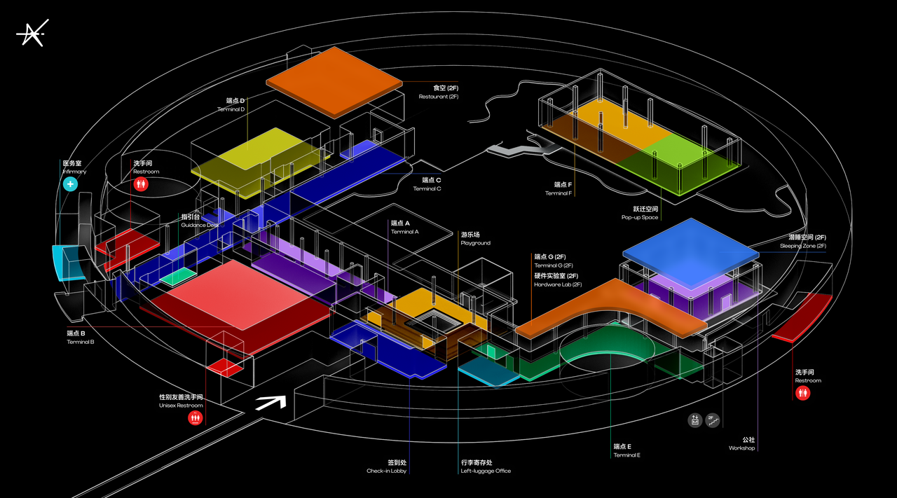

import Aside from '../../../components/ui/Aside.astro';
import Badge from '../../../components/ui/Badge.astro';

## 先把地图摊开：你在设计的是一种关系

很多学生组织第一次办黑客松，会把“场地”当成一个需要租到的容器：能坐下多少人、有没有空调、有没有投影、能不能通宵。等这些都勾选完，大家才开始谈体验。可真正决定体验的，往往不是你租到了哪栋楼，而是你如何让这栋楼里的人彼此相遇、彼此不打扰、彼此被照顾。

所以请先把地图摊开，像看一座城市一样看它。你不是在划分区域，你是在安排关系：谁会在这里停下脚步，谁会在这里被迫绕路，谁会在凌晨三点在最脆弱的时候被一个小小的指引牌救回一口气。你也在安排一种价值观：你把最好的位置留给谁，你把最安静的角落留给谁，你把“特权”藏在哪些门禁和动线里。场地会不说话地把这些都讲出来。

AdventureX 作为一个案例，最重要的一点不是它有多大、多炫，而是它始终试图把“创造是一种平等”落实到物理空间：没有高高在上的台阶，没有被围起来的贵宾岛，没有把“尊重”写在海报上却把它从动线里删掉。你也应该在你的城市做到同样的事，即使你的场地只是两层教学楼。

## 入口与第一次相遇：签到是一场温柔的审判

签到区是现实世界与黑客松世界之间的缝。这里做不好，后面做再多补救都像是在修补第一次见面留下的裂纹；这里做得好，整个场域会在第一小时就长出一种信任。

你需要同时完成两件看似矛盾的事：让流程足够快，让情绪足够慢。快，是因为长队会让人焦躁、让人觉得自己被当作流水线；慢，是因为每个人都拖着行李和陌生感来，他们需要被认真对待。你可以在签到台旁边留出一个“停留”的理由：一面破冰墙、一块签名板、一句让人愿意写下去的问题，或者只是一盏灯、一张桌子和几支好写的笔。

破冰墙不要做成“打卡任务”，它应该更像一张同类地图：有人写 <Badge>#Rust</Badge>，有人写 <Badge>#产品</Badge>，有人写 <Badge>#二三线城市</Badge>，有人写 <Badge>#我第一次来</Badge>。当这些卡片密密麻麻铺开，很多人会第一次意识到：原来我不是一个人在做梦。你不需要逼任何人社交，但你要让“可以开始说话”这件事变得不那么难。

## 动线与场域边界：把“打扰”从设计里删掉

黑客松最昂贵的资源不是硬件，不是咖啡，而是心流。心流一旦被打断，重新进入需要的不是五分钟，而是一段很难计算的精神成本。动线设计的目标之一，就是尽可能少地打断心流。

这意味着你要非常明确地划分“开放”和“专注”。有些区域天然适合围观、拍照、聊天、路过，比如入口大厅、展位区、公共走廊；也有些区域必须被保护起来，比如核心创作区、设备密集区、深度休息区。保护不是把人拒之门外，而是让每个人都知道边界在哪里、为什么在那里，并且用清晰的指引和工作人员的温柔解释去维护它。

挂牌/手环/贴纸这类身份识别，也应该被设计成一种“透明”而不是“等级”。颜色区分的是权限与职责，而不是价值高低。一个好的场域，会让人看到某个颜色就立刻明白：这个人可以帮我解决什么问题，或者我需要在什么时段、什么区域保持克制。这些细节，决定了秩序是否能做到“几乎不可见”。

## 社交的心脏：让偶然发生，但别让人被迫社交

许多组织误以为“社交氛围”来自主持人、小游戏、强行组队。其实真正能改变一个项目命运的社交，往往发生在最不起眼的时刻：两个人端着水杯在走廊对视了一秒，某个人在白板前停住脚步问了一句“你们在做什么”，有人在沙发上说“我们卡住了”，旁边的人顺手递过去一个思路。

你需要做的，是为这种偶然提供物理条件。给人一个可以站住的角落，一块可以随手写两笔的白板，一些让人愿意坐下来的椅子、沙发、地毯。让这个地方看起来不像会议室，更像一个可以自然呼吸的公共客厅。你也需要给那些不擅长社交的人留后路：让他们可以路过、旁听、离开，不必被任何人的热情绑架。

如果你想把场地当成一台发动机，那么社交区就是它的点火系统：点燃的不是喧闹，而是连接。

## 核心创作区：让心流不被电源和 Wi‑Fi 打断

核心创作区的设计，应该是一种对“把事情做成”的尊重。这里不需要过多装饰，它需要的是稳定、秩序和一种明确的暗示：你可以在这里把世界搭起来。

桌子要足够深，插座要足够近，线缆要有办法被收束。网络要稳定到让人几乎忘记它的存在，同时也要准备好最朴素但可靠的应急方案，因为任何组织者都不该把整场活动的命运押在“希望路由器别出事”上。灯光不要只考虑拍照好不好看，也要考虑屏幕反光、眼睛疲劳，以及凌晨时分的情绪。

如果你设置硬件区，请把它当成一个带有风险的“实验室”，而不是一个随便摆几台设备的角落。越是昂贵的设备，越要用更清晰的规则、更顺畅的流程和更温柔的指导去保护它，同时也去保护使用它的人。硬件区的秩序不是为了限制创造，而是为了让创造能持续发生。

## 测试日：把最坏情况提前演一遍

场地测试日不是“走个流程”，它是一场你必须认真对待的预演。你要尽可能模拟活动最糟糕、也最真实的时刻：人最多的时候，网最慢的时候，空调最容易跳闸的时候，大家最焦虑的时候。

让你的核心成员真的坐进去工作半天，像参赛者一样插满插座、连满设备、下载依赖、推代码、开视频、放音乐、试投影、试麦克风。你会在这一天发现很多纸面上看不见的问题：某个角落信号很差，某排插座接地不好，某个门禁会在夜里自动锁死，某条通道在高峰期会形成拥堵。

如果你只能认真做一件“看起来很无聊”的事，那就认真做测试日。它会在活动开始后的第三天、第四天、第五天，用几乎无可替代的方式回报你：让创造者把精力花在创造上，而不是花在与你的漏洞搏斗上。

## 签到区：理想国的第一道大门

签到区是现实世界与逃逸计划的交界点。这不仅是一个效率的问题，更是一个仪式感的问题。在 AdventureX，我们要求签到处必须在活动开始前一小时就处于完美状态。当选手提着厚重的行李，跨越数千公里来到现场，他们拿到的那份物资包和特制的挂牌，就是他们进入这个理想国的登机牌。

我们建议在签到处设置一面巨大的破冰墙。不要让大家只是签个名，要让他们写下自己的技术标签，或者是那些极其私人的、能代表灵魂的爱好。当几百张写着 <Badge>#Rust</Badge> <Badge>#AnalogSynth</Badge> <Badge>#CatLover</Badge> 的卡片堆叠在一起时，参与者会瞬间意识到，自己正身处一个由同类组成的社区。这种视觉上的震撼，能瞬间消融选手初来乍到时的怯意，为接下来的组队和协作建立最底层的信任。

## 社交的心脏：游戏场与跃迁空间

黑客松不仅是极限的代码编写，更是高频的灵感交换。我们需要一些能让人“松弛”下来的空间，我们称之为社交的心脏。比如充满懒人沙发的游乐场，在这里，你可以躺着思考，可以和刚认识的朋友打一局复古游戏，甚至只是在午后的阳光里发呆。

还有那些随时可以进行即兴演讲或激烈讨论的跃迁空间。配上大屏幕、白板和充足的马克笔，鼓励那些“喧闹”的思维碰撞。这些区域的存在是为了告诉每一位创造者：在这里，灵感不一定非要坐在电脑前产生，它往往诞生于那些非正式的、充满偶然性的交流中。我们要通过场地的设计，强行制造这种“偶然”。

## 核心创作区：不间断的生产引擎

公社与实验室是活动的引擎，需要兼顾专注与协作。这里是 Builder 们的主战场，每一寸空气都应该充满正在构建的气息。我们需要确保每一个工位都有充足的电源和极其稳定的网络，让技术细节不再成为创造的阻碍。

硬件实验室则是一个带有神圣感的区域。这里存放着昂贵的 3D 打印机、激光切割机、各种型号的开发板和传感器。在 AdventureX，这个区域仅限选手进入，不仅是为了设备的安全，更是为了营造一种专业实验室的氛围。当选手在这里调试机械臂或焊接电路板时，他们能感受到一种亲手改变物理世界的踏实感。

## 生存保障：生活区与潜睡空间

为了让创造不间断，你必须以最高标准照顾好选手的生理需求。餐饮区不应仅仅是吃饭的地方，它应该成为社区交流的枢纽。食物的供应必须是持续且高质量的，让能量的补充变得像呼吸一样自然。

而潜睡空间则是整个理想国里最静谧的港湾。这里严禁办公，严禁聊天，只有适宜的空调温度和柔软的寝具。我们深知，只有在梦境中给大脑充好电，才能迎接下一个 24 小时的挑战。这种对休息的尊重，本质上是对创造力最大的保护。

## 基础设施的极限压测

在正式开始前，核心团队必须进行一次测试日。这不是演习，而是对场地真实承载能力的极限挑战。我们需要模拟几百人同时上传代码、下载海量依赖包的场景，看看路由器的并发能力是否会崩溃。我们需要检查每一个插座的接地是否良好，空调在满负荷运转时是否会跳闸。

实践是检验场地的唯一标准。你永远无法预料，当十台 3D 打印机同时开启“狂暴模式”时，电线发热的情况会是如何。只有经过这种近乎偏执的测试，我们才能自信地告诉选手：在这里，你尽管去创造，所有的后勤与安全保障，都由我们来背负。

当你最终完成这张平面图的设计，请闭上眼睛，想象自己是一个第一次参加黑客松的少年。从签到开始，到寻找工位，到深夜去拿一罐可乐，再到清晨在沙发上被第一缕阳光唤醒。如果这条路径让你感到兴奋且舒适，那么你的理想国就已经在物理世界中找到了它的坐标。
